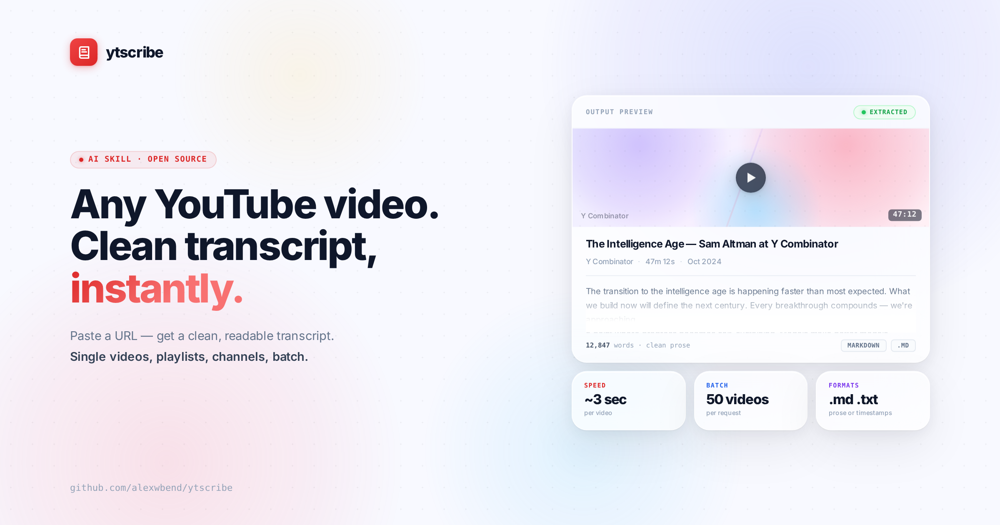

<p align="center">
  <a href="LICENSE"></a>
  
  
  
  
</p>

<p align="center">
  An open-source AI skill that extracts clean, readable transcripts from any YouTube video.<br/>
  Single videos, batch lists, playlists, and entire channels.
</p>

---

## What is ytscribe?

ytscribe is an **AI skill** — a set of instructions and a Python helper script that gives any AI assistant the ability to extract YouTube transcripts on demand. Paste a URL, get a clean transcript. No browser extensions, no subscriptions, no manual copy-pasting.

It understands four types of input automatically and handles each one with smart defaults, so you get a result immediately without answering setup questions first.

> **Philosophy:** The user should never answer a question before seeing their first result. ytscribe detects what you gave it, applies sensible defaults, delivers immediately, and only then offers alternatives.

---

## Install

Add [`SKILL.md`](SKILL.md) as a knowledge file in your AI assistant's project or custom instructions.

**In agentic environments that can run code on your machine** — Cowork, Claude Code, Cursor, Windsurf, Cline, and similar tools — that's the whole install. The skill auto-installs its own dependency (`yt-dlp`) the first time it runs, saves transcript files directly to your machine, and handles everything end to end.

**In chat-based environments** — ChatGPT, Gemini, DeepSeek, Qwen, and similar — ytscribe works as a guided workflow: the AI reads your request and generates the exact command to run. You'll need `yt-dlp` and `scripts/ytscribe.py` installed locally, then paste the command in your terminal when prompted.

```bash
pip install yt-dlp
```

---

## Four modes, zero friction

ytscribe detects your input automatically.

### Single video
Paste one URL. Get a transcript. Short videos appear inline; long ones are saved as a file.

```
Transcribe: https://youtube.com/watch?v=qp0HIF3SfI4
```

### Small batch (2–9 URLs)
Paste a list of URLs. Get individual markdown files, one per video, no questions asked.

```
Transcribe: [URL1] [URL2] [URL3]
```

### Playlist
Paste a playlist URL and ytscribe fetches the total count, shows you the first 10 titles as a preview, and asks how many you want before running. Specify a count in your prompt to skip the question entirely.

"First" and "last" follow the playlist's own order as set by the creator, not upload date.

```
Transcribe: https://youtube.com/playlist?list=PLxxxxxx
```
```
Transcribe the first 10 videos from: https://youtube.com/playlist?list=PLxxxxxx
```
```
Transcribe the last 10 videos from: https://youtube.com/playlist?list=PLxxxxxx
```

### Channel
Paste a channel URL and ytscribe shows you the most recent uploads and asks how many you want. Specify a count in your prompt to skip the question.

"Last N" means most recent N uploads, newest first.

```
Transcribe: https://youtube.com/@TED
```
```
Transcribe the last 7 videos from: https://youtube.com/@TED
```

---

## Output formats

| Format | Default | How to request |
|--------|---------|----------------|
| Clean prose | ✓ | — |
| Timestamped | | "with timestamps" |
| Markdown `.md` | ✓ | — |
| Plain text `.txt` | | "as a text file" |
| Individual files | ✓ | — |
| Merged (1 file) | | "merged", "one file", "combine all" |
| Auto-zipped | ✓ if 6+ files | — |
| Language | Video's own language | "in English", "in French", any language name |

Language note: ytscribe uses the video's original language by default: a French video gives you a French transcript. If you request a different language and subtitles in that language aren't available, it falls back to the video's original language and tells you which one was used.

If you specify a preference in your first message, ytscribe silently honors it.

---

## What you get

Every transcript includes a clean metadata header:

```markdown
# The Intelligence Age — Sam Altman

- **Channel:** Y Combinator
- **Duration:** 47m 12s
- **URL:** https://youtube.com/watch?v=H6eYLpCgAI0
- **Date:** 2024-10-15

---

The transition to the intelligence age is happening faster than most people expected.
What we're building now will define the next century...
```

Batch runs summarize results at the end:

```
✓ Success:     24/25
⚠ No subs:     1/25  (music video — skipped)
📝 Total words: 187,432
📁 Output:      24 individual .md files + ytscribe_batch_24_videos.zip
```

---

## Batch limits

| | |
|---|---|
| Speed | ~3 seconds per video |
| Recommended batch | 25 videos (~2 min) |
| Hard limit | 50 videos per run |
| Rate limiting | Auto-handled with exponential backoff |

YouTube throttles subtitle requests after rapid successive downloads. ytscribe adds a 2-second delay between requests and retries automatically on 429 errors (5s → 10s → 15s).

---

## For developers

The [`scripts/ytscribe.py`](scripts/ytscribe.py) helper runs standalone and can be integrated into any pipeline:

```bash
python3 scripts/ytscribe.py \
  --videos "dQw4w9WgXcQ,H6eYLpCgAI0" \
  --format md \
  --merge true \
  --timestamps false \
  --lang en \
  --output-dir ./output
```

Results are returned as JSON for easy parsing by the AI or downstream tools.

---

## License

MIT — free to use, modify, and distribute. See [LICENSE](LICENSE).

---
